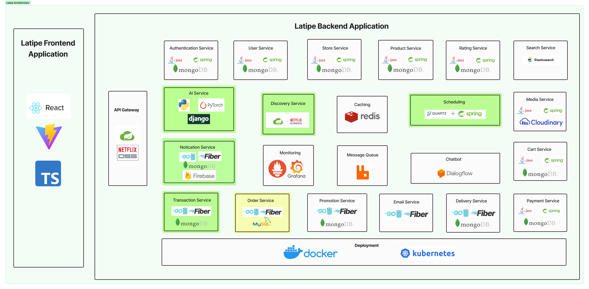

# Giới thiệu dự án

Xin chào mình là **Đạt**. Dự án này là sản phẩm của khóa luận tốt nghiệp của nhóm mình gồm 2 thành viên. Website được lên ý tưởng dựa trên các trang thương mại như Tiki, Shopee, Lazada nên có tên là Latipe =)). 

Trong khi **Long** sẽ phụ trách phát triển các service bằng `Java (Spring)` và phần Frontend bằng `React`. Còn mình sẽ thiết kế về phần xử lý của hệ thống và các service sử dụng `Go`. Nhiệm vụ của nhóm mình là hoàn thành website này sao cho các tính năng có thể sử dụng có thể sử dụng trong thực tế.

Dự án này được tụi mình bắt đầu vào khoản tháng 07/2023 đến khi nào thì chưa chắc 😂.

### Thành viên

Nhóm sinh viên **Trường Đại Học Sư Phạm Kỹ Thuật**:
>Trần Tiến Đạt (K20)
>
>Hồ Thái Long (K20)

### Tổng quan kiến trúc

Có khoảng 17 service và các tool đi kèm để vận hành đi kèm

#### Công nghệ sử dụng
- Java (Spring)
- Golang (Fiber v2)
- Typescript (React)
- Python (PyTorch)
- MySQL
- MongoDB
- Redis
- RabbitMQ
- Elasticsearch
- Docker
- Firebase Cloud Message
- Prometheus
- Grafana
- etc.
## Tham khảo
Đây chỉ là trang tài liệu về dự án, do để deploy cả hệ thống này và duy trình nó sẽ tốn kinh phí rất lớn nên mình tạo ra trang này để mọi người có thể xem qua những thứ mà nhóm đã thực hiện và cách hệ thống của tụi mình hoạt động.

Chi tiết về các chức năng và thành phần bên trong hệ thống được nhóm mình trình bày trong trang web này các bạn có thể xem qua.

Đây là dự án mà bọn mình khá quyết tâm để thực hiện, nếu bạn có ý kiến cũng như sử dụng dự án này với mục đích nào thì có thể liên hệ tụi mình nhé. Cảm ơn các bạn
